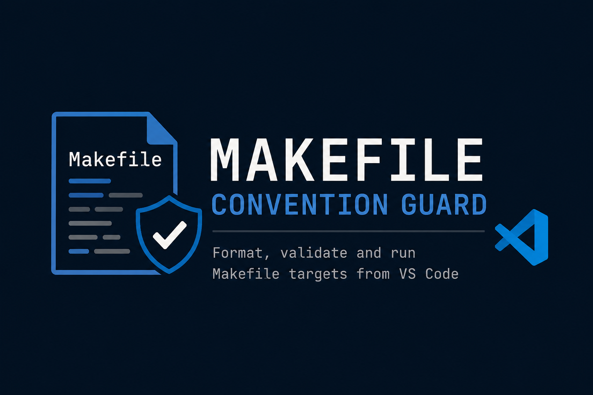

<p align="center">
  
</p>

<p align="center">
  VS Code extension for formatting, validating and running <strong>Makefile</strong> targets using configurable project conventions.<br/>
  Built with TypeScript and focused on Makefile diagnostics, formatting rules and developer workflow automation.
</p>

---

<h2 align="center">Technologies Used</h2>

<p align="center">
  
  
  
  
  
  
</p>

---

# Makefile Convention Guard

VS Code extension created to help standardize Makefile files through diagnostics, formatting conventions and command execution directly from the editor.

## 📚 About

**Makefile Convention Guard** is a Visual Studio Code extension focused on improving the maintainability of Makefiles used in project workflows.

The extension aims to provide a consistent development experience by combining:

* Makefile diagnostics;
* whitespace lint rules;
* configurable validation settings;
* unit-tested diagnostic rules;
* formatter support;
* future quick fixes;
* future Make target execution from a VS Code interface.

The project was created to enforce simple and practical Makefile conventions while keeping the rules configurable, testable and easy to evolve.

## ✨ Features

Current features for the initial version:

* Validate trailing whitespace in Makefiles.
* Detect multiple consecutive blank lines.
* Detect missing final newline at the end of the file.
* Detect blank lines between a Makefile target and its first recipe command.
* Register diagnostics in the VS Code **Problems** panel.
* Use TypeScript for safer extension development.
* Use pure analyzer functions for fast unit testing.
* Provide a modular structure for future rules, formatters and commands.

Future features planned for upcoming versions:

* Validate Makefile section headers.
* Validate helper sections using `##@`.
* Validate target descriptions using `##`.
* Provide quick fixes for common convention issues.
* Format Makefiles using project conventions.
* Display Makefile targets in a VS Code tree view.
* Run Makefile targets from a play button in the editor interface.

## 📂 Repository Structure

```text
makefile-convention-guard/
├── assets/
│   └── thumb.png
├── src/
│   ├── config/
│   │   └── getDiagnosticSettings.ts
│   ├── diagnostics/
│   │   ├── createDiagnostic.ts
│   │   ├── message.ts
│   │   ├── registerDiagnostics.ts
│   │   ├── validateMakefileStyle.ts
│   │   └── rules/
│   │       ├── whitespaceAnalyzer.ts
│   │       └── whitespaceRules.ts
│   ├── makefile/
│   │   └── parser.ts
│   ├── tests/
│   │   └── unit/
│   │       └── whitespaceAnalyzer.test.ts
│   ├── types/
│   │   └── diagnostics.ts
│   ├── utils/
│   │   └── lineUtils.ts
│   ├── constants.ts
│   └── extension.ts
├── dist/
├── package.json
├── package-lock.json
├── tsconfig.json
├── README.md
└── .gitignore
```

## 🚀 Technologies

* Visual Studio Code Extension API
* TypeScript
* Node.js
* Mocha
* Makefile
* Git
* GitHub

## 🎯 Project Objectives

* Create a VS Code extension for Makefile convention enforcement.
* Provide simple and configurable lint rules for Makefiles.
* Improve consistency across Makefile-based project workflows.
* Keep the extension modular, testable and easy to extend.
* Use TypeScript to improve type safety and maintainability.
* Prepare the project for future formatter, quick fix and Make command execution features.
* Prepare the project for CI using fast unit tests.

## ⚙️ Development Setup

Install dependencies:

```bash
npm install
```

Compile the extension:

```bash
npm run compile
```

Run TypeScript type checking without emitting files:

```bash
npm run check
```

Watch TypeScript files during development:

```bash
npm run watch
```

## 🧪 Running Tests

The project currently uses **Mocha** for fast unit tests.

The whitespace validation logic is split into a pure analyzer module so it can be tested without starting the VS Code Extension Host.

Run unit tests:

```bash
npm run test:unit
```

Run the default test command:

```bash
npm test
```

Recommended validation before committing:

```bash
npm run check
npm run compile
npm run test:unit
```

Current unit test coverage includes:

* trailing whitespace;
* multiple consecutive blank lines;
* missing final newline;
* blank line before recipe command;
* disabled diagnostics;
* disabled individual whitespace rules.

## 🧪 Running the Extension Locally

Open the project in VS Code and press:

```text
F5
```

This opens a new **Extension Development Host** window.

Then open a file recognized as `makefile`, such as:

```text
Makefile
```

The extension activates through the following activation event:

```json
"activationEvents": [
  "onLanguage:makefile"
]
```

## 🔍 Diagnostics

The initial diagnostic rules focus on whitespace conventions.

### Trailing whitespace

Warns when a line ends with unnecessary spaces or tabs.

```makefile
NODE_VERSION := 22   
```

### Multiple blank lines

Warns when there are two or more consecutive blank lines.

```makefile
NODE_VERSION := 22


DOCS_DIR := docs
```

### Missing final newline

Warns when the file does not end with a final newline.

### Blank line before recipe command

Warns when there is a blank line between a Makefile target and its first recipe command.

Invalid format:

```makefile
test:

	nvm install
```

Expected format:

```makefile
test:
	nvm install
```

## 🛠️ Available Scripts

```json
{
  "compile": "tsc -p ./",
  "watch": "tsc -watch -p ./",
  "check": "tsc --noEmit -p ./",
  "test:unit": "npm run compile && mocha \"dist/tests/unit/**/*.test.js\"",
  "test": "npm run test:unit",
  "vscode:prepublish": "npm run compile"
}
```

## 🧭 Versioning Roadmap

### v1.0.0

Initial version focused on:

* project structure;
* TypeScript build configuration;
* Makefile diagnostics registration;
* simplified whitespace lint rules;
* pure whitespace analyzer;
* unit tests for whitespace diagnostics.

### Future versions

Planned improvements:

* Makefile formatter;
* helper validation;
* section validation;
* quick fixes;
* Make command tree view;
* interface-based command execution;
* VS Code integration tests;
* CI pipeline.

## 👨‍💻 Author

### Allef Oliveira Ramos

* GitHub: https://github.com/allef-oliveira
* Repository: https://github.com/allef-oliveira/makefile-convention-guard

## 📄 License

This project is licensed under the ISC License.
